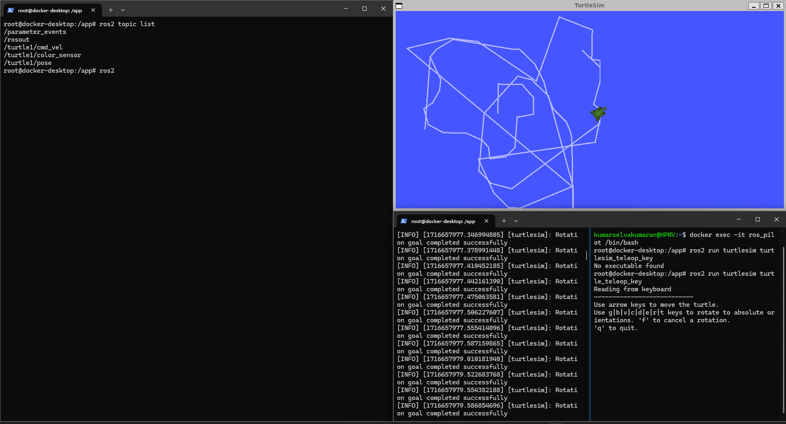

last worked : 5/25/2024 
left at : <a href="https://docs.ros.org/en/jazzy/Tutorials/Beginner-CLI-Tools/Understanding-ROS2-Services/Understanding-ROS2-Services.html"> ros2 services tutorial </a>

ros2 node list
ros2 topic list
ros2 service list
ros2 action list

You will learn more about these concepts in the coming tutorials. Since the goal of this tutorial is only to get a general overview of turtlesim, you will use rqt to call some of the turtlesim services and interact with turtlesim_node.

4 Install rqt
s</a>

 

Environment vaiables not set as required

mine :  <code>
ROS_DISTRO=jazzy
</code> 
Required :  
<code>
ROS_VERSION=2 
ROS_PYTHON_VERSION=3 
ROS_DISTRO=jazzy
</code>

 ros_nodeid = 38 

Nothing here

 